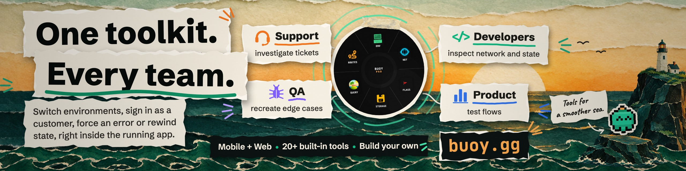
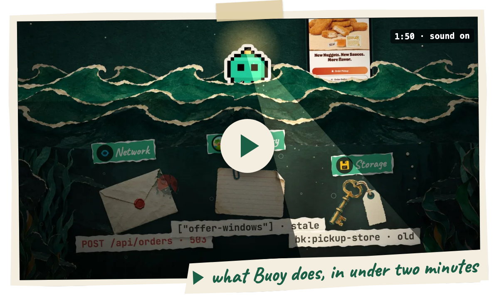
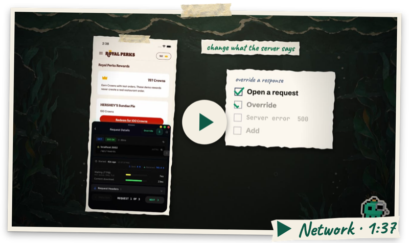
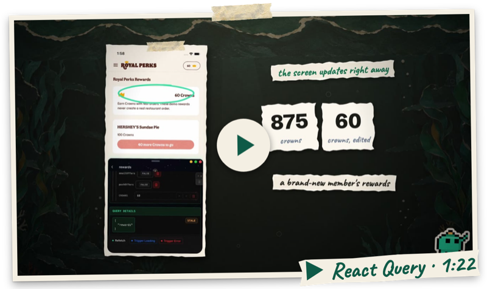
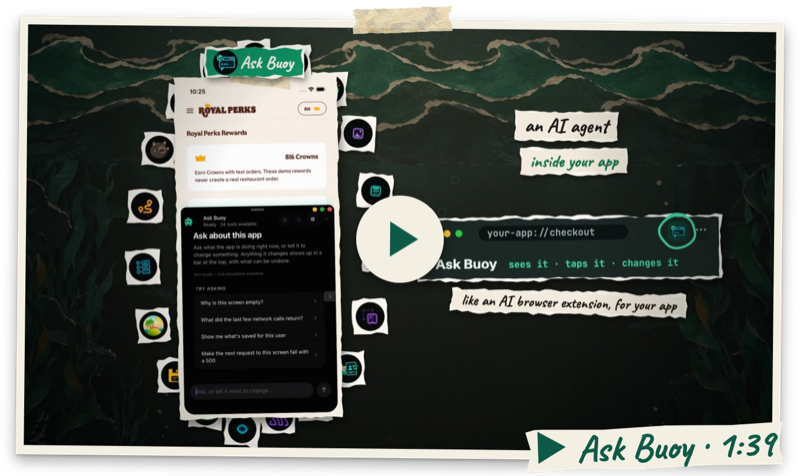

<div align="center">

<a href="https://buoy.gg"></a>

### Developer tools that live inside your app.

<a href="https://buoy.gg"><b>buoy.gg</b></a> &nbsp;·&nbsp; <a href="https://buoy.gg/buoy/latest/docs/overview">Docs</a> &nbsp;·&nbsp; <a href="https://buoy.gg/buoy/latest/docs/quick-start">Quick start</a> &nbsp;·&nbsp; <a href="https://github.com/Buoy-gg/Buoy-Desktop">Desktop</a> &nbsp;·&nbsp; <a href="https://buoy.gg/pricing">Pricing</a>

[](https://www.npmjs.com/package/@buoy-gg/core) [](https://www.npmjs.com/package/@buoy-gg/core) [](https://www.npmjs.com/package/react-native-react-query-devtools)

</div>

<br />

Buoy puts a floating menu in your React Native app. Open it on the device to look at network requests, storage, query caches and stores, routes, renders and performance, and change them while the app runs. The same session can also connect to Buoy Desktop, to your coding agent over MCP, or to Ask Buoy inside the app.

Flutter has its own [setup for debug builds](https://buoy.gg/buoy/latest/docs/flutter/quick-start).

<p align="center">
  <a href="https://buoy.gg"></a>
</p>

## Get started

The quickest way in is to let your coding agent do it. Paste the prompt below into Claude Code, Cursor or Codex. It follows [buoy.gg/install.md](https://buoy.gg/install.md), installs the core plus the tools that match your dependencies, and tells you how to check it on the device.

<details>
<summary>Agent install prompt</summary>

```text
Install Buoy, the in-app devtools for React Native and Expo, in this project.

Read the full instructions first:
  curl -fsSL https://buoy.gg/install.md
Read the raw text, not a summary. If curl is unavailable, use any HTTP tool you have. Ask me to paste the document only if nothing can fetch it.

Do the install yourself: inspect the repo, run the commands, edit the files. Do not hand me steps you can run.

Work out the routine decisions from the repo: package manager, which app to target, where the menu mounts, which Buoy tools match the dependencies already installed. If Buoy is already partly installed, repair and extend it; never add a second mount, provider, or package set.

When instructions conflict, follow this order: what I say here, then the document's rules about which packages exist and what needs my permission, then this project's own constraints, then the rest of the document, then your judgment.

Ask me before: adding a native dependency, opening a browser or creating an account, changing what a production build does beyond what the document specifies, or anything hard to undo. Do not commit.

You are not done when the packages install. Run this project's existing typecheck; add no tooling. Then report what you installed and why, what you skipped and why, every file you changed, what you verified, and the exact steps I take on the device to confirm the menu appears and captures a request.
```

</details>

To install by hand, start with the core and the Network tool, then sign in:

```bash
npm install @buoy-gg/core @buoy-gg/network
npx --package=@buoy-gg/core buoy login
```

Mounting the menu, loading your key and adding more tools are covered in the [Quick start](https://buoy.gg/buoy/latest/docs/quick-start). You need a development build and a Free or Pro Buoy account.

## See it work

Each tool has a short film on its docs page, recorded on a real app.

<table>
  <tr>
    <td width="33%" align="center"><a href="https://buoy.gg/buoy/latest/docs/tools/network"></a></td>
    <td width="33%" align="center"><a href="https://buoy.gg/buoy/latest/docs/tools/react-query"></a></td>
    <td width="33%" align="center"><a href="https://buoy.gg/buoy/latest/docs/tools/ask-buoy"></a></td>
  </tr>
  <tr>
    <td align="center">Read, time and override requests</td>
    <td align="center">Edit cached data, force loading and error states</td>
    <td align="center">An agent inside your app</td>
  </tr>
</table>

## Tools

Install only the ones your app needs. Each link goes to its guide.

[Network](https://buoy.gg/buoy/latest/docs/tools/network) · [Storage](https://buoy.gg/buoy/latest/docs/tools/storage) · [Time Machine](https://buoy.gg/buoy/latest/docs/tools/time-machine) · [Ask Buoy](https://buoy.gg/buoy/latest/docs/tools/ask-buoy) · [Env](https://buoy.gg/buoy/latest/docs/tools/env) · [React Query](https://buoy.gg/buoy/latest/docs/tools/react-query) · [Routes](https://buoy.gg/buoy/latest/docs/tools/routes) · [Debug Borders](https://buoy.gg/buoy/latest/docs/tools/debug-borders) · [Highlight Updates](https://buoy.gg/buoy/latest/docs/tools/highlight-updates) · [Bench](https://buoy.gg/buoy/latest/docs/tools/perf-monitor) · [JS Top](https://buoy.gg/buoy/latest/docs/tools/js-top) · [Images](https://buoy.gg/buoy/latest/docs/tools/images) · [Assets](https://buoy.gg/buoy/latest/docs/tools/assets) · [Events](https://buoy.gg/buoy/latest/docs/tools/events) · [Console](https://buoy.gg/buoy/latest/docs/tools/console) · [Sentry](https://buoy.gg/buoy/latest/docs/tools/sentry) · [Redux](https://buoy.gg/buoy/latest/docs/tools/redux) · [Zustand](https://buoy.gg/buoy/latest/docs/tools/zustand) · [Jotai](https://buoy.gg/buoy/latest/docs/tools/jotai) · [Impersonate](https://buoy.gg/buoy/latest/docs/tools/impersonate) · [TV Remote](https://buoy.gg/buoy/latest/docs/tools/tv-remote) · [Focus Inspector](https://buoy.gg/buoy/latest/docs/tools/focus-inspector) · [Camera](https://buoy.gg/buoy/latest/docs/tools/camera) · [Overlay](https://buoy.gg/buoy/latest/docs/tools/image-overlay)

## Beyond the device

[Buoy Desktop](https://github.com/Buoy-gg/Buoy-Desktop) shows your connected tools in desktop panels and lets you switch between devices. The [MCP server](https://buoy.gg/buoy/latest/docs/mcp) lets an AI editor read and change the running app. Both need `@buoy-gg/external-sync` in your app; the [Desktop guide](https://buoy.gg/buoy/latest/docs/desktop) covers the connection.

Buoy starts in development builds. Turning it on in a shipped app takes Pro and your own access checks; read the [component reference](https://buoy.gg/buoy/latest/docs/floating-devtools) before you do.

## Feedback

Found a bug, or want a tool that doesn't exist yet? [Open an issue](https://github.com/Buoy-gg/buoy/issues). Feature requests shape what gets built next.

## License

Proprietary software. © Buoy LLC. All rights reserved. See the [Terms of Service](https://buoy.gg/terms).
